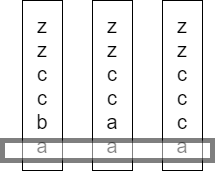

# 1002. 查找常用字符
我一开始不想用官方的那种方式，感觉开销有点大。我自己写的那个算法更适合再 C 或者 C++ 下实现，Python 下的话有点蠢，，，

我的想法：

1. 先把字母按从大到小的顺序排列；

2. 比较最下面的那一行，如果元素都相同，那么 res.append()；如果元素不同，删掉序号小的那（几）个，重复 2。

## 官方
1. 统计一个单词中字母的出现次数，生成一个字典

2. 统计其他单词中字母的出现次数，如果新单词某个字母出现的次数小于第一步字典中记录的次数，更新步骤一的字典

3. 根据字典生成结果

如果不用字典的话还是我的方法比较好吧（强吹一波嘤嘤嘤）
