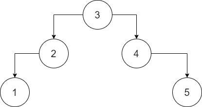
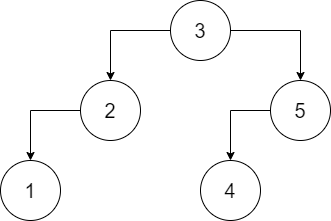

# 109. 有序链表转换二叉搜索树
这道题我一开始的想法是把这个链表展开成 V 字形。整个算法的思想就是（具体代码见 109.py）：

1. 给链表增加指向前一个元素的指针

2. 找到中间节点

3. 根据向前向后的指针把链表展开成 V 字

但是这样是没有办法通过，可能这样不是 leetcode 所期望的二叉树吧。

leetcode 所期望的二叉树大概有这样的特征：

1. 左子树元素大于等于右子树元素

2. 树在保证平衡的情况下尽可能的满

3. 不允许只存在右子树不存在左子树

看起来应该是这样的。

于是我换了个思路，先数一下有多少个元素，根据元素的个数生成符合标准的二叉树就行了啊。。。

根据数字 i 生成二叉树的算法如下：

1. 根据 i 算出左子树和右子树应该有的元素个数 l r

2. 如果左子树的元素个数大于 1，将 i 的值改为 l 并执行第一步，否则生成一个 TreeNode 节点

3. 生成一个 root 节点

4. 如果右子树的元素个数大于 1，将 i 的值改为 r 并执行第一步，否则生成一个 TreeNode 节点

5. root 的左子树就是第 2 步返回的子树，root 的右子树是第 4 步返回的子树

6. 返回 root

有了二叉树之后，中序遍历一次，把树节点的值更改为链表上的值就可以了。

109-fix.py 不完全按照以上算法实现，实际操作中，在生成树节点的同时，就在链表中取值作为树节点的值了。
