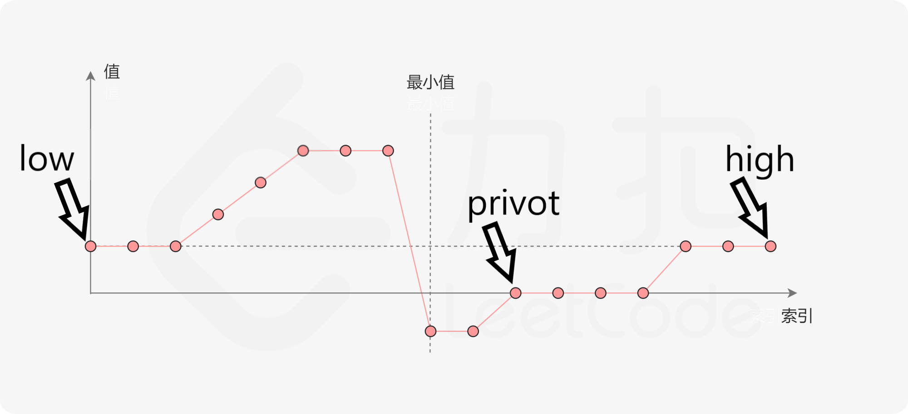
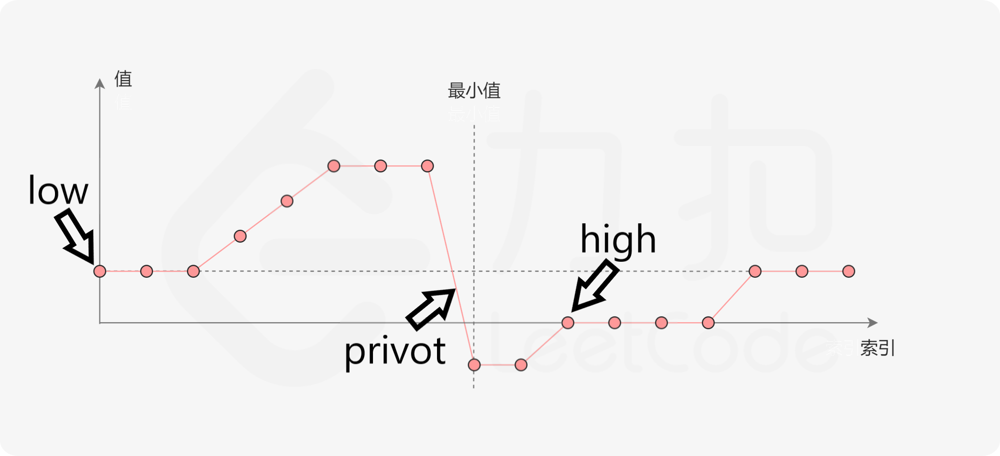
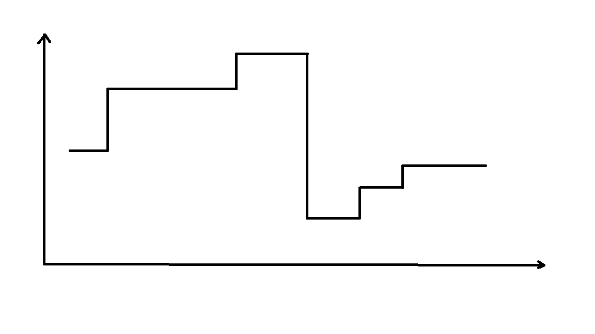

# 154 —— 寻找旋转排序数组中的最小值 II
这道题的难点有两个：

1. 算法如何进行下去

2. 算法如何停止

听起来有点废话，所有的算法都需要面对这两个问题，只是这道题尤其难吧。

基本的思路还是二分法，但是如果 low pivot high 指向的元素大小相同，到底是用 privot 替换 high 呢？还是替换 low 呢？（算法如何进行下去）

由于存在重复元素，那么就不可以用 ` numbers[privot -1 ]<numbers[privot]<numbers[privot +1] ` 作为算法的停止条件了。把 < 变成 <= 也不行，例如 `2 2 2` 就会错误的停止算法。（算法什么时候停止）

## 算法如何进行下去
在 153 中，我们只让 privot 与 low 进行了比较就知道了下一步应该如何处理 low privot high，本体是否还可以这样比较呢？

本题中数组的格式大概是下面这个样子：

先考虑简单的问题，low high privot 指向的元素的值均不一样。

考虑第一次选择，low 是第一个元素，high 是最后一个元素，privot=(low+high)//2。若 privot > low 则说明下个区间一定在 [privot,high]，否则 [low,privot]。

考虑第二次选择，假设 privot > low，high = privot，如果 privot 取到了如图所示的位置，第一步的判断条件在第二步会得到错误的结论。

那怎么办？其实 privot 不可以取到那个位置。因为本题中的数组是旋转排序数组，遵循分段递增原则，若 privot 处有元素，就会让数组产生长度大于 2 的递减序列，不符合旋转排序数组的定义。其实更像是这个图，没有斜边。

同理，以 high 为基石也可以。

在以 low 为基石的情况下，考虑较为复杂的问题，如何 low=privot 怎么办。

复杂的情况需要特殊的处理，特殊的处理往往引入较高的复杂度，这是肯定的。我们最多只能希望在最坏的情况下，特殊的处理不会使本算法的复杂度远高于可以解决本问题的另一种算法。

以本题为例，遍历一次数组一定可以找到最小值，算法的复杂度为 O(n)。在不考虑相同元素的情况下，基于二分查找思想的本算法的复杂度为 O(logn)。因此我们希望特殊的操作不会让二分查找的复杂度大于 O(n)。

在以 low 为基石的情况下，low = privot，不可以确定最小值是在 [low,privot] 还是在 [privot,high]。但是可以确定的是，一定不在 low 上，如果输入为 [2,2,2]，即使错过了 low 处的 2，privot 还有 2。如果输入是 [2,1,2,2,2]，就更棒了，把 low+1 之后更加接近真实的最小值了。

因此遇到相等的情况就 low+1。

## 算法如何停止
上文已经分析过由于存在重复元素，不可以用 ` numbers[privot -1 ]<numbers[privot]<numbers[privot +1] ` 作为算法的停止条件了。

上文描述的算法可以保证最小点一定在 [low,high] 之间，而且算法每运行一个循环，[low,high] 的大小至少缩小 1。这个缩小是有极限的，缩小到 0，因此当 `low+1 == high` 的时候，最小值就找到了。

