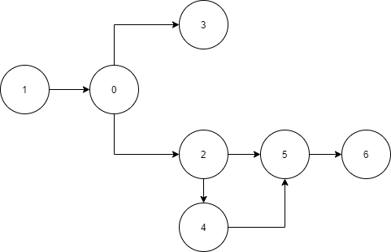

# 210
这个题并不难，使用图的遍历就可以得到答案，本题用 dfs 和 bfs 的难度是不一样的。



从逻辑上来讲，确定一门课所依赖的课程就是将其指向的所有节点访问一遍，这种思想天然就是 bfs；如果用 dfs 在逻辑上就变成了先找到一个没有任何依赖的课程，把该课程加入到结果中，然后退回上级，将上级所有的依赖加入结果中之后，再把上级加入到结果中。bfs 和 dfs 可以看成从顶向下和字底向上两种算法思想。

基于 kahn 也可以做，kahn 算法保证了每次加入到结果数组中的节点都是“无依赖”的（被选中的节点依赖的节点已经在结果数组中或没有依赖节点）。


## 在 python 中定义全局变量
一般格式为：
```python
global loop # 告诉编译器我要把哪个变量作为全局变量
loop = False # 初始化

# 接下来就可以在其他地方使用 loop 全局变量啦
def test():
    loop = True
```

网上的例子具有一定的误导性，比如:

```python
gl_name = "hello"

print(gl_name)

def change_name():
    # 对全局变量进行修改
    global gl_name
    gl_name = "world"

change_name()
print(gl_name)

```

这样做会侥幸得到正确的结果，是因为 gl_name 本来就被声明为全局变量，使用 global gl_name 的作用是把全局变量引入，而不是声明一个新的全局变量。

以上的定义方法会在以下例子得到错误的结果：

```python
def change_name():
    # 对全局变量进行修改
    # global n1
    n1 = "n1"
    print(n1)

    def t1():
        global n1
        n1 = "n11"

    t1()
    print(n1)

change_name()
```

在这种情况下会输出两次 n1。如果想要把 n1 变成全局变量，则需要这样更改：

```python
def change_name():
    # 对全局变量进行修改
    global n1
    n1 = "n1"
    print(n1)

    def t1():
        global n1
        n1 = "n11"

    t1()
    print(n1)

change_name()

```

现在 change_name 函数下把 n1 声明为全局变量，然后在函数 t1 内使用 global 关键字把当前命名空间中的 n1 更换为全局变量。

和网上的例子殊途同归吧，因为网上的例子变量定义在 “全局变量空间”，因此省去了我们例子中第一次 global 的使用。


## nonlocal 作用于函数中的函数
nonlocal 从字面意思上看是声明为非局部变量，在函数中定义的函数中使用。

```python
def t():
    n1 = "n1"
    print(n1)
    def tt():
        nonlocal n1
        n1 = "n11"
    tt()
    print(n1)

t()

```

在本例中，nonlocal n1 使 tt() 函数中的 n1 指向了函数 t() 内定义的 n1 变量，在函数 tt() 内更改 n1 的值，函数外 n1 的值也会变化。

