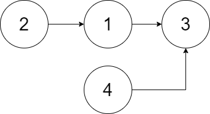

# 24. 两两交换链表中的节点
我最初的想法是用迭代的做法，想着只需要选中两个节点，交换一下，然后前进两步就行。这种做法有个致命的问题，前一段（指两个节点）需要指向下一段新的头，所以我那种把段和段单独分开处理的做法就不会得到正确的答案。以下图为例，上面的处理方法得到的结果是 `2->1->3`。

为了补救，需要加入第三个指针。第一个指针指向上一段最后一个节点即可。

## 递归
递归的做法是真的秀到我了。

迭代的处理节和节之间的方法很朴素，用了三个指针。迭代的话，“把希望交给下一个轮回了”。

每次迭代都返回调转顺序之后的段的头节点，所以上层递归只要等着下层返回之后，让段尾指向返回值就行。
