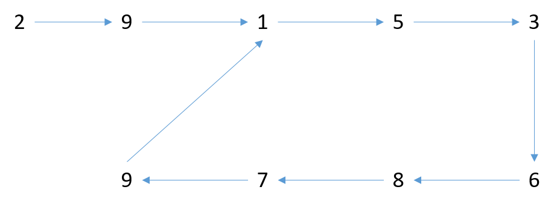

# 287. 寻找重复数
这道题需要先理解 142 题，通过快慢指针找环的入口的原理。

然后分析为什么把 slow 设置为 0 后，当两个指针“相遇”的时候，就找到了数组中的重复元素。

举个稍微复杂一点的例子：[2,5,9,6,9,3,8,9,7,1]，连起来后是这个样子的。

第一步，我们已经让快慢指针相遇，相遇点记为 MP。

第二步，我们让慢指针指向数组开头（数组开头会不会在圈里呢？）

第三步，快慢指针一步一步走，直到相等（地址相等还是数值相等呢？），此时快指针或慢指针的值就是重复数字。

快慢指针一步一步走，一定会在入环处相遇，但是在入环之前的前一跳就已经满足快指针==慢指针了。这是必然的，因为数组里只有一个重复数字，所以如果一个节点有多个父节点的话（即这里的 1 号节点有多个父节点），那这些父节点的值一定相等。父节点才是我们要找的节点。

- Tips

    数组开头不会在圈里。因为数组里的数字是从 1 开始的，所以无论如何数组头部都不会在环里。
