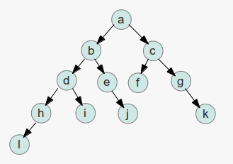

#  337. 打家劫舍 III
在我看了许久之后，才发现这道题满足最优子结构，所以就用 dp 了。

## 最优子结构
本题中的最优子结构是指：对于任何一棵（子）树，打家劫舍能得到的钱的最大值一定是：

1. 根节点的钱数+四个孙子树打家劫舍能得到的最大钱数

2. 两个儿子树打家劫舍能得到的最大钱数

这两种情况之一，对于每一个孙子树/儿子树而言，也满足这两个情况，所以符合最优子结构。

## 存储状态的结构
这道题的特殊之处在于，之前的 dp 都是一维表或者二维表，很直观，这次变成了树，也没有很抽象，但是很难表示。没办法用一个 F[] 数组去表示状态了。

dp 和遍历（递归）最大的差别就是有一个存储子结构结果的数组，没有这个数组的话，会有大量重复的计算，导致时间复杂度居高不下。

但是一维表、二维表又不适合本题，所以本题我就直接把计算结果存储在树的节点上了。给每个树新增了一个属性 `maxVal` 如果存在这个属性，直接返回这个值，没有再进行计算。

### 本题哪里会出现重复计算呢？

a 节点需要 [b,c] 和 [d,e,f,g] 子树的结果；

b 节点需要 [d,e] 和 [h,i,j] 的结果；

d 节点作为 a 节点的孙子树被计算了一次，作为 b 节点的儿子树被计算了一次，所以又重复计算。

## 自顶向下 vs 自底向上

在本题中第 k 层每一颗子树的最大盗窃数与 k+1 层子树和 k+2 层子树有关系。

在上一节已经说明了为什么用自顶向下的算法，在不存储中间值的情况下，会导致重复计算。如果第 k 层结果只与第 k+1 层有关系的话，自顶向下的算法也不会导致重复计算。

但是自底向上一定会有中间值存储，且一定不会有重复计算。自底向上的计算方法是从第 k+1 和 k+2 层到第 k 层，所以如果不记录 k+1 层和 k+2 层的话，算法也没办法进行下去。

对于一维二维 dp，存储 k+1 k+2 很简单，用 list 就可以实现，但是对于本题而言，有点难。毕竟是一个树状结构，对于动态类型的语言可以直接在节点上加一个新的属性用于记录中间值，如果是 c++ 那种静态类型的语言呢？

推荐去看一下 337-b2t.py。

整个算法基于后序遍历，后序遍历又基于递归，函数每次完整的运行一次都可以得到两个子节点的信息，那么设计函数的返回值就很重要了。如果我们把“选中子节点的最大值”和“不选中子节点”的最大值同时返回给上级，那么上层就同时得到了 k+1 和 k+2 层的信息。这样就在不给节点添加属性的情况下完成了中间结果的记录。

代码 337-b2t.py 中的第 14 行是 max 精华。fn2 表示不选择当前 root 节点的最大值，不选择当前 root 节点并不代表一定要选择 root 节点的子节点，所以那一行不是 `fn2 = lChild[0] + rChild[0]`，而是 `fn2 = max(lChild) + max(rChild)`。

