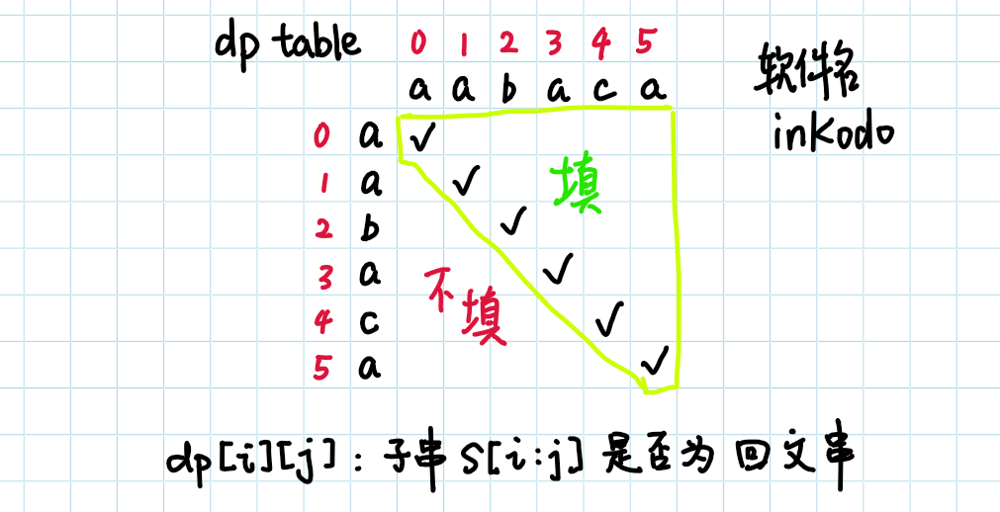

# 647. 回文子串
我在用贪心泛型想了一会儿之后，就觉得这个题目好像非要遍历才行。遍历出所有的子字符串，然后依次检查是否为回文串。

既然涉及到遍历，那么 dp 怎么能不出来凑个热闹呢，我就想如何将这个问题用 dp 的思路来解决。

因为之前做过的 dp 都具备结果存储在 F 数组里面的特征，所以这次我也理所当然的用 F 存储本题的结果，用 F[i][j] 表示字符串 s[i:j+1] 之间回文串的数目。在确定了 F 的意义之后，突然发现这个问题好像没办法拆解成子问题啊。。。

字串 s[i:j] 的回文串数目和 s[i:j+1] 的回文串数目没有固定关系。eg：`aab` -> `aabb` 回文子串增加了 4（ab,bb,aabb,b），`ab` -> `aba` 回文子串增加了 2（aba,a）。每新增一个字符，都需要用 O(n) 的复杂度重新判断，F 数组形同虚设。

还是我太年轻了。为什么 F 数组一定要表示最终的结果呢？F 数组主要是为解决、拆分子问题提供简便的方法，定义本文的主要问题就是最关键的点。

本题明面上的问题是字符串有多少回文子串。这个问题可以拆分成很多步，每一步也都是一个问题。我们以最简单暴力的想法最为蓝本：先将字符串拆分成子串，再对每一个单独的子串判断是否为回文串。

拆分为子串需要两重循环，时间复杂度为 $O(n^2)$，拆分出 $n^2$ 个子串，每个子串需要完整的看一遍，才能知道是不是回文串，时间复杂度是 O(n)，因此最终的时间复杂度是 $O(n^3)$。

至此我们把 *字符串有多少回文子串* 这个问题拆分为了 *拆分子串* 和 *判断回文* 两个问题。

拆分子串没什么好说的吧，只能这样了。判断回文可以用 dp 进行优化吗？判断回文可以拆分为子问题吗？

答案是可以。若字符串 `abba` 是回文串，则对原字符串去头断尾之后的子串 `bb` 也一定是回文串，反之亦然。

抽象为程序语言就是：若 s[i:j] 为回文串，则 s[i+1:j-1] 一定是回文串。

边界条件也很好定义：只有一个字符的时候是回文串，其他情况就判断去头去尾的情况就好了。

最后一个 trick 就是如何构建循环。dp 的循环一定是从边界条件开始的，我选择了从右下角开始，最后看起来是这个样子的。对勾（√）的地方一定是回文串；圆圈（⭕）的地方需要判断两个字符是否相等，不需要表 F；其余地方的判断需要左下角表格的结果。

## Manacher 算法
可以看官方的视频教程 https://leetcode-cn.com/problems/longest-palindromic-substring/solution/zui-chang-hui-wen-zi-chuan-by-leetcode-solution/

这个算法可以做到 O(n) 的时间复杂度。
