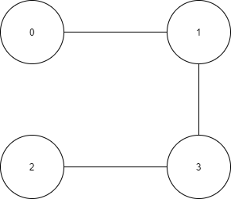
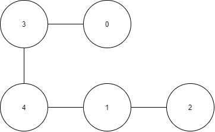

# 785
785 是一个图论题。

二分图的判决依据是：对于图中的任意两个节点 u 和 v，u 和 v 必须属于不同的集合。

有了判决条件之后，我就开始设计循环，如何遍历所有的点呢？

一开始我的想法很简易，见 785-1.py，直接按照节点顺序从 0-n 依次遍历。每到一个节点只把自己和相邻的节点分到两个集合里面去，如果遍历到自己的时候没有被任何一个集合收录，那么就自动加入第一个集合。这样有问题，没有充分利用已知信息，加入集合的方式过于随便。调试一下 785-1.py 就知道了。

然后把规则改的不那么随便，在加入集合的时候判断自己的邻接节点是否加入了集合，有的话就自己就选另一个集合。如果邻接节点包含了两个集合，那么就结束算法返回 false。

治标不治本，当图例很大的时候，0，1 节点很可能距离很远很远，实际上 0 1 不可以分在同一个集合，但是在算法之初由于信息不够，很可能就把 0 1 分在一起了。调试 785-2.py 就知道了。

所有还是那个问题，怎么遍历节点呢？

一定要把所有的信息利用上。

比如用 bfs 的思想，以边为链接，把算法继续下去，这样就不会出现大图情况下“左右开弓”而导致的算法错误了。

785-final.py 就是在 bfs 思想下写的算法。

# bfs 和 dfs 在数据结构上的区别
bfs 需要一个顺序队列来记录需要遍历的元素。

dfs 需要一个栈，每层栈记录当前节点还有哪些节点没有被遍历。
