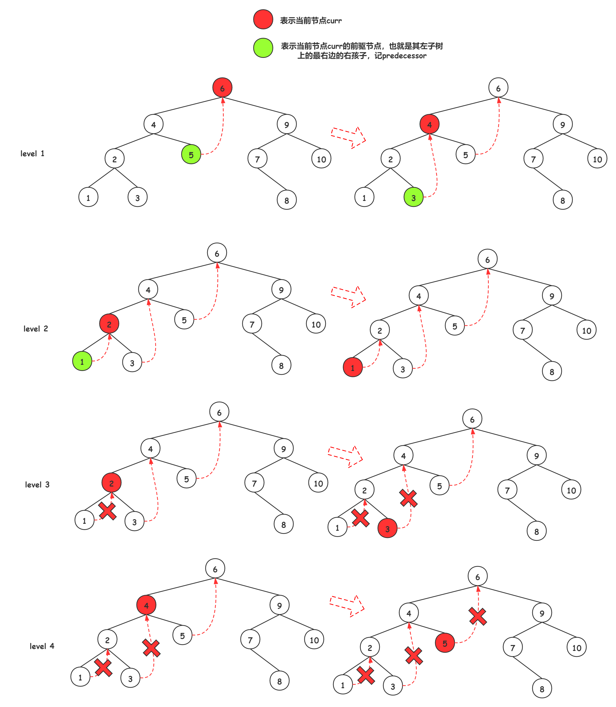

# 99. 恢复二叉搜索树
这道题的思路很清晰，由于源数据是排序二叉树，所以遍历一次之后可以得到升序数组。现在又两个元素的位置兑换了，大概是这个样子：

$$1,2,3,4 \rightarrow 1,4,3,2$$

4 和 2 换了位置。第一个需要修正的元素的特征为：从他开始导致了长度为 2 的一段降序序列（4，3）；第二个元素的特征为小于前一个元素（3，2）。

自定义的类（TreeNode）作为函数的参数的时候，传入函数的是引用，所以设置两个全局变量用于存储应该交换的节点，找到之后把这两个节点的值互换即可，不需要考虑更改节点的父节点和子节点。

我自己的实现有点不优雅，用了太多的全局变量。官方给出了三种题解，第一种是递归，第二种是循环（但是自己维护了一个栈把循环进行下去），第三种是 Morris 中序遍历，Morris 中序遍历比较讨巧，整个算法基于循环，通过给叶子节点找退路，避免了维护栈。

实现可以参考 99-Morris.py，虽然 leetcode 不让我的代码过，但是跑了一次他的测试数据没有问题啊，疑惑。。。。

Morris 原理可以参考:https://leetcode-cn.com/problems/recover-binary-search-tree/solution/yi-wen-zhang-wo-morrisbian-li-suan-fa-by-a-fei-8/

完成代码之后好像也没有优雅多少，，，少用了一个全局变量就这样吧。

